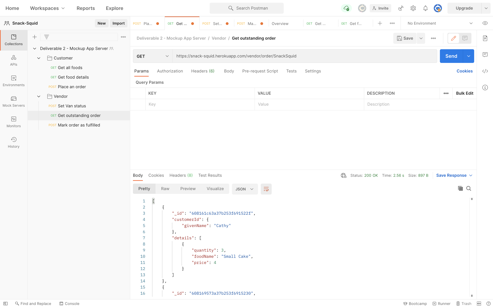

**The University of Melbourne**
# INFO30005 – Web Information Technologies

# Snack Squid Repository

## Updates
### 23 April 2021
To check delivarable 2, please go to [Deliverable 2 Instruction](#deliverable-2-instruction). Note: please mark **"snack-squid"** folder. Commit Id is

## Table of contents
* [Team Members](#team-members)
* [Technologies](#technologies)
* [Deliverable 2 Instruction](#deliverable-2-instruction)
* [Code Implementation](#code-implementation)

## Team Members

| Name         |   State  |  StudentID  |
| :---         |   -----  |       ---:  |
| Tom Zhi Hern | Working  |   1068268   |
| Qian Ziyu    | Working  |   1067810   |
| Yu Kaixin    | Working  |   1118795   |
| Yi Qiteng    | Working  |   1048534   |
| Chen Yi      | Working  |   911748    |

## Technologies
Project is created with:
* NodeJs : 14.16.X
* Express : 4.17.1
* mongoose : 5.12.3

## Deliverable 2 Instruction
### Notes: 
1. Use *Postman* to test our routes.
2. If the route is working, a json formatted output will be sent to you.

### Accessing MongoDB Atlas
- Username: ziyuq@student.unimelb.edu.au
- Password: Shsss06@20

### Customer
1. To see the menu, go to [https://snack-squid.herokuapp.com/customer/menu] with GET method.
   
1. To see the details of one specific food. go to [https://snack-squid.herokuapp.com/customer/menu/:tag] with GET method. 
    
    Replace **quantity** and **foodTag** with one of the following:
    |      Food     |      :tag     |
    | :---          |          ---: |
    | Small Cake    | small-cake    |
    | Big Cake      | big-cake      |
    | Plain Biscuit | plain-biscuit |
    | Fancy Biscuit | fancy-biscuit |
    | Latte         | latte         |
    | Long Black    | long-black    |
    | Cappuccino    | cappuccino    |
    | Flat White    | flat-white    |
1. To place an order, go to [https://snack-squid.herokuapp.com/customer/menu] with POST method and insert yout order in this format
    
    An order detail will be sent to you in json format once the order has been sent successfully. Please note that you are only required to insert foodTag and quantity as you are assummed logged in and a van is assummed selected.

### Vendor
1. To set the van status, using the route [http://snack-squid.herokuapp.com/vendor/open-for-business/:[samplevan]] using POST method. If you have "location" in you req.body, it will update the location and change open status as true. If you have no location, it will send a message "You have to enter location"

    
2. To show the list of all outstanding orders,go to [http://snack-squid.herokuapp.com/vendor/order] and it will show the orders of all vans. If want to get orders for specific van, using [http://snack-squid.herokuapp.com/vendor/order/:vanName]

    
3. To mark an order as "fulfilled", go to [http://snack-squid.herokuapp.com/vendor/order/:vanName] and use "_id" in req.body to look up specific order of the van and mark it as fulfilled. The status of order in mongodb will be "fulfilled"

    

## Deliverable 3 
### Login Section
dummy customer: 
Email Address: kcathy@gmail.com
Password: 123123

### Van detail
We only have one van open, which is SnackSquid.

### URL details
http://localhost:3000/customer/
**Now Get ready to complete all the tasks:**

- [x] Read the Project handouts carefully
- [x] User Interface (UI)mockup
- [x] App server mockup
- [ ] Front-end + back-end (one feature)
- [ ] Complete system + source code
- [ ] Report on your work(+ test1 feature)

